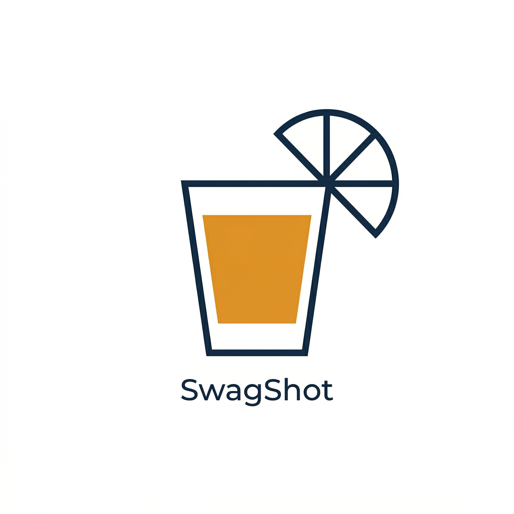

<p align="center">
  
</p>

# swagshot

Swagger/OpenAPI 스펙으로 TypeScript API 함수와 타입 정의를 자동 생성하는 CLI 툴.

프로젝트 구조를 자동 감지해서 기존 코드 스타일에 맞는 코드를 생성합니다.

## 특징

- **프로젝트 구조 자동 감지** — API 폴더, 타입 폴더, axios 인스턴스, react-query 등
- **Swagger 2.0 / OpenAPI 3.0** 모두 지원 (Spring Boot, NestJS 등)
- **axios / fetch** 스타일 코드 생성
- **커스텀 axios 인스턴스** 자동 연결
- deprecated 엔드포인트 자동 제외

## 설치 없이 바로 사용

```bash
npx swagshot <command>
```

## 사용법

### 1. 프로젝트 초기 설정 (처음 한 번만)

프로젝트 루트에서 실행:

```bash
cd /your/project
npx swagshot init
```

프로젝트 구조를 자동으로 감지하고 `.swagshot.json` 설정 파일을 생성합니다.

```
👋 swagshot 초기 설정을 시작합니다.
📂 프로젝트 루트: /your/project

자동 감지 결과를 확인해주세요. Enter를 누르면 기본값 사용:

Swagger JSON URL (기본값: ):
API 함수 폴더 (기본값: src/api):
타입 정의 폴더 (기본값: src/types):
...
```

### 2. 컨트롤러 목록 확인

```bash
npx swagshot list --url "https://api.example.com/v2/api-docs"
```

```
📋 컨트롤러 태그 목록 (12개):

  1. auth-controller
  2. payment-controller
  3. order-controller
  ...
```

### 3. 코드 생성

```bash
# 특정 컨트롤러만
npx swagshot generate --url "https://api.example.com/v2/api-docs" --tag payment-controller

# 전체 생성
npx swagshot generate --url "https://api.example.com/v2/api-docs" --all

# deprecated 포함
npx swagshot generate --url "https://api.example.com/v2/api-docs" --tag payment-controller --include-deprecated
```

### 4. 설정 변경

```bash
npx swagshot config set apiDir src/services
npx swagshot config set httpClient fetch
npx swagshot config set axiosInstance src/lib/fetcher.ts
```

## 생성 결과 예시

`payment-controller` 기준으로 두 파일이 생성됩니다.

**`src/types/payment.ts`**
```typescript
// Auto-generated by swagshot
// Tag: payment-controller
// Do not edit manually

export interface PaymentHistoryResponse {
  id: number;
  price: number;
  status: string;
  createdAt: string;
}

export interface GetHistoryUsingGETParams {
  startDateTime: string;
  endDateTime: string;
  payment_product_types?: string[];
}
```

**`src/api/payment.ts`**
```typescript
// Auto-generated by swagshot
// Tag: payment-controller
// Do not edit manually

import fetcher from '../lib/fetcher';
import type { PaymentHistoryResponse, GetHistoryUsingGETParams } from '../types/payment';

/** 결제 히스토리 조회 */
export const getHistory = (params: GetHistoryUsingGETParams) =>
  fetcher.get<PaymentHistoryResponse[]>(`/v2/payments/history`, { params });

/** 결제 히스토리 상세 조회 */
export const getPaymentHistory = (paymentHistoryId: number) =>
  fetcher.get<PaymentHistoryResponse>(`/v2/payments/history/${paymentHistoryId}`);
```

## 설정 파일 (.swagshot.json)

```json
{
  "version": "1",
  "project": {
    "root": "/your/project",
    "apiDir": "src/api",
    "typesDir": "src/types",
    "hooksDir": null,
    "outputDir": "src/api"
  },
  "style": {
    "httpClient": "axios",
    "axiosInstance": "src/lib/fetcher.ts",
    "queryLibrary": "react-query",
    "namingConvention": "camelCase"
  },
  "swagger": {
    "url": "https://api.example.com/v2/api-docs"
  }
}
```

> `.swagshot.json`은 `.gitignore`에 추가를 권장합니다.

## Swagger JSON URL 찾는 법

Swagger UI 페이지 URL이 아닌, JSON 스펙 URL이 필요합니다.

| 프레임워크 | JSON URL 패턴 |
|-----------|--------------|
| Spring Boot (springfox) | `/v2/api-docs` |
| Spring Boot (springdoc) | `/v3/api-docs` |
| NestJS | `/api-json` |

## 전체 커맨드

```bash
npx swagshot init                          # 프로젝트 초기 설정
npx swagshot list --url <url>              # 컨트롤러 목록 조회
npx swagshot generate --url <url> --tag <tag>   # 특정 컨트롤러 생성
npx swagshot generate --url <url> --all    # 전체 생성
npx swagshot config set <key> <value>      # 설정 변경
```

## 개발 환경 설정

```bash
git clone https://github.com/Jyophie/swagshot.git
cd swagshot
npm install
npm run build
node dist/cli/index.js --help
```

## License

MIT
